# <div style="display: flex; align-items: center; gap: 20px;"> Deducktible</div>

<br />


<br /><br />

## Contribute ❤️

🔒 Any added feature has been previously discussed in a Github issue.

🙏 For organizational reasons, please only include what is in the ticket when working on a feature.

👍 Please name your branches with the issue number you are working on as a prefix.

🕵️‍♂️ When writing commits, please follow the conventional commit standards by using the types :

```yaml
    feat:     A new feature
    fix:      A bug fix
    chore:    Other changes that don't modify src or test files
    style:    Changes that do not affect the meaning of the code
    revert:   Reverts a previous commit
    docs:     Documentation only changes
```

<br/>
If you want to find out more about conventional commit, see : <a href="https://www.conventionalcommits.org/en/v1.0.0/">https://www.conventionalcommits.org/en/v1.0.0/</a>
